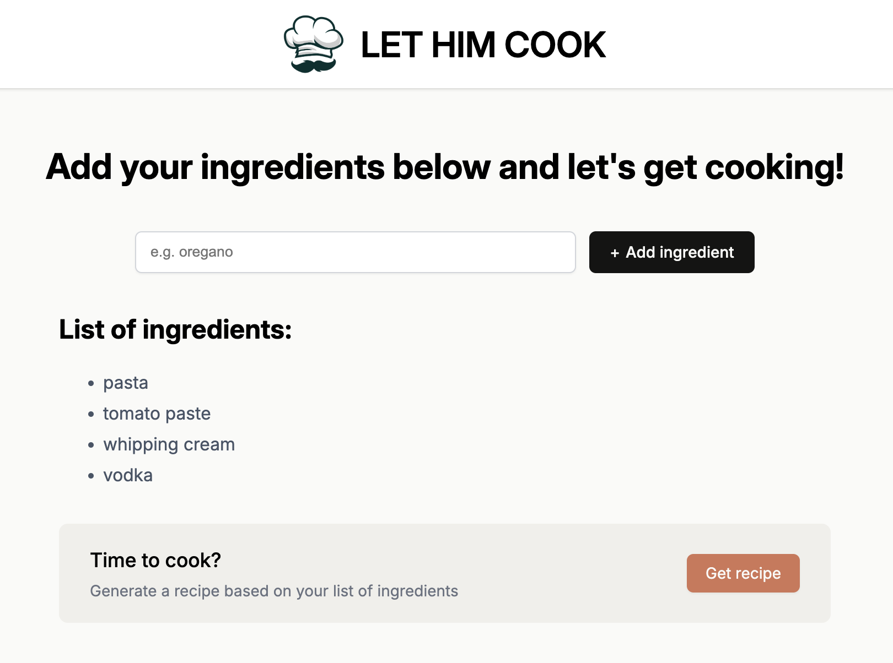
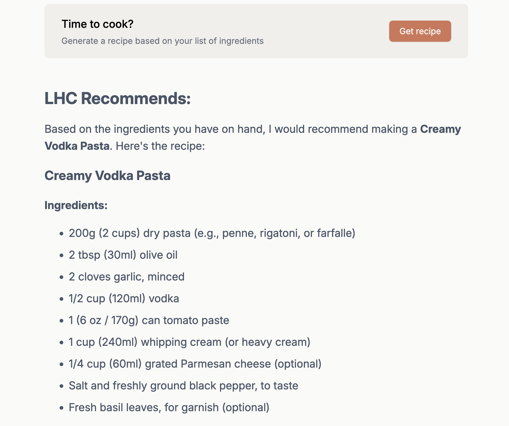
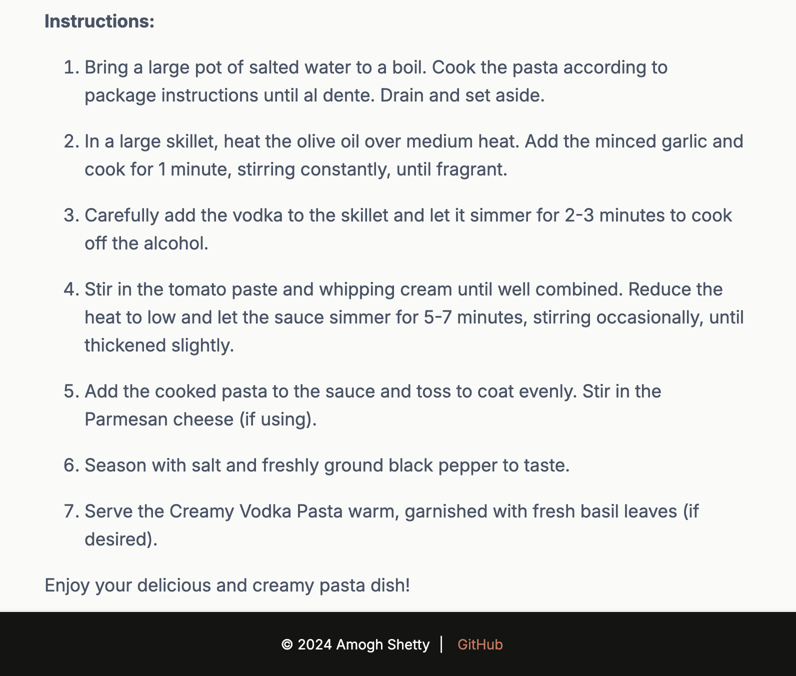

# Let-Him-Cook-AI 👨‍🍳

Let-Him-Cook-AI is a React-based web application that leverages the power of Claude's API and generates delicious recipes tailored to the ingredients you have on hand. Whether you're a seasoned chef or a kitchen novice, Let-Him-Cook-AI makes meal planning effortless and fun!

---

## Screenshots 📸

### Ingredient Input

### Recipe Generation

### Recipe Instructions

---

## Live Site 🌎

- Check out the live site using the link below:
- https://lethimcook-ai.netlify.app/ 

---

## Features ✨

- **Ingredient-based Recipe Generation**: Enter the ingredients you have, and Let-Him-Cook-AI will create a recipe for you using Claude's cutting-edge AI capabilities.
- **User-friendly Interface**: Intuitive design ensures a smooth and engaging user experience.
- **Dynamic Components**: Modular React components for seamless performance.
- **Responsive Design**: Works flawlessly on both desktop and mobile devices, so you can cook on the go.

---

## How It Works 🛠️

1. **Input Ingredients**: List the ingredients you have available.
2. **Generate Recipes**: Hit the "Get Recipe" button to generate a recipe tailored to your inputs.
3. **Start Cooking!**: Explore the generated recipe and start cooking!

---

## Tech Stack 🖥️

- **Frontend**: React.js
- **Backend/AI Integration**: Claude API
- **Styling**: CSS/Styled Components

---

## Project Structure 📂

Below is an overview of the key components:

- `ClaudeRecipe.jsx`: Handles API calls to Claude and renders the recipe output.
- `IngredientList.jsx`: Allows users to input and manage their list of ingredients.
- `Header.jsx`: Displays the app's title and navigation.
- `Footer.jsx`: Provides additional app information and links.
- `Main.jsx`: Orchestrates the main functionality of the app.

---